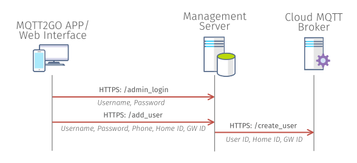
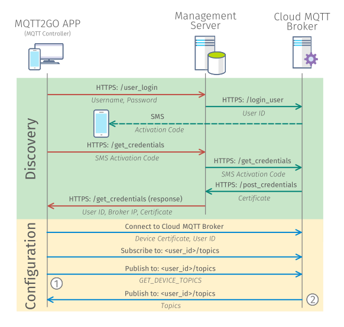

[Back](./index.md#add-devices)
# Setup new MQTT2GO Controller
The MQTT2GO Controllers are vital part of any MQTT2GO-enabled installation. They are the entry point for users that want to interact with the whole MQTT2GO ecosystem. This is true for all the MQTT2GO installation no matter if there is or is not the local MQTT2GO broker.

From the perspective of the whole MQTT2GO communication infrastructure, the setup of the Controller brings one new element that have to be utilized. It is the Management Server, which has to be operated by the MQTT2GO adopter and which contains all the neccessary information about the MQTT Brokers (ip addresses, names) and Users. These users have to be created by the adopter authority as it is the only way how to maintain the security.

This section defines how the creation of a new MQTT2GO account and addition of a new MQTT2GO Controtroller is done.

## Creation of new MQTT2GO account
The new MQTT2GO account creation proccess utilizes credentials provided by the MQTT2GO standard adopter entity. They are meant to be provided after the initial  client registration proccess to the adopter's system. The creation proccess steps are following:

1. The MQTT2GO App / Web Interface connects to the management server via __HTTPS: /admin_login__ using the provided credetials (Username and Password).
1. The MQTT2GO APp / Web Interface sends a request containing the Username, Password, Phone Number, Home ID, and GW ID to the Management server on the  __HTTPS: /add_user__.
1. Management server forwards this information to the correct MQTT2GO cloud broker, which then creates the user.

	

	<em><strong>Fig. 1:</strong> Proccess of creating new MQTT2GO account.</em>

## Creation of new MQTT2GO controller
The MQTT2GO controller creation proccess can be initialized only if the MQTT2GO account creation was successfull. If so, the initially created user is able to 

	

	<em><strong>Fig. 2:</strong> Proccess of login into MQTT2GO account (adding new MQTT2GO controller).</em>

[Back](./index.md#add-devices)
