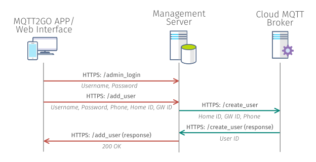
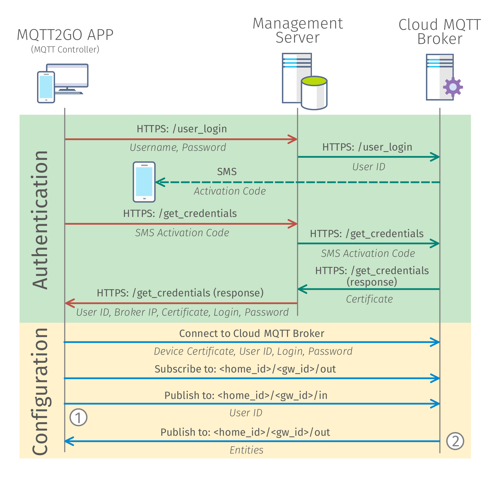

[Back](./index.md#add-devices)
# Setup new MQTT2GO Controller

	

	<em><strong>Fig. 1:</strong> Proccess of creating new MQTT2GO account.</em>

	

	<em><strong>Fig. 2:</strong> Proccess of login into MQTT2GO account (adding new MQTT2GO controller).</em>

[Back](./index.md#add-devices)