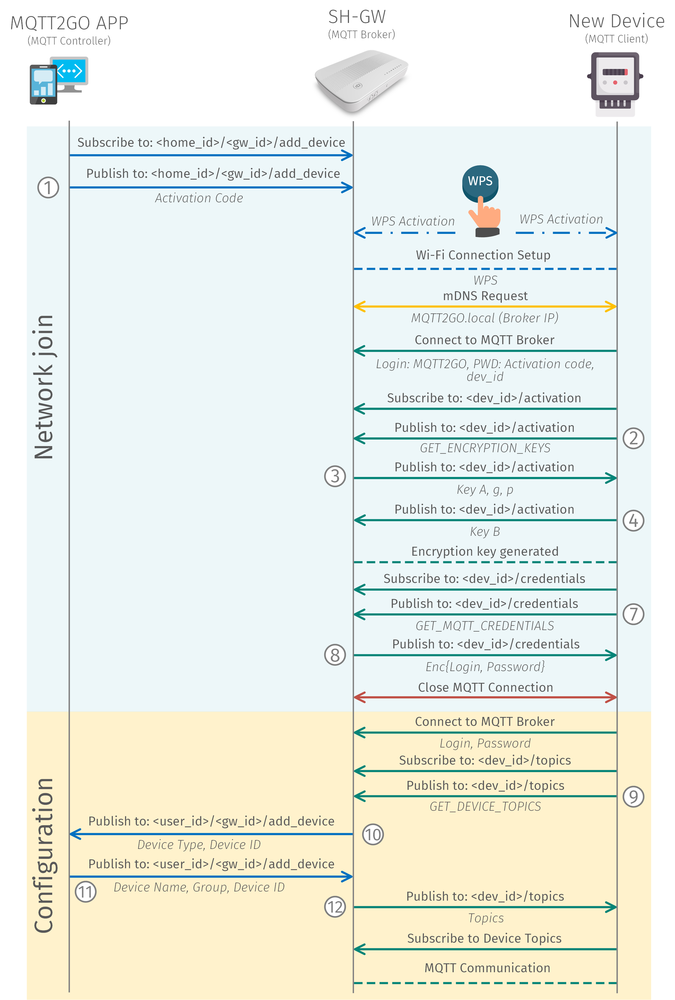
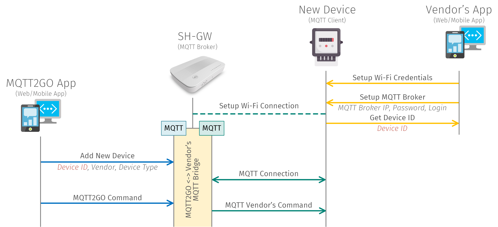

#  Process of Adding New Devices
In this chapter, we are going to present a few ways how to add a new device. Firstly, the ideal process is described. Then the other ways of adding devices are introduced.

## Setup via Guest WiFi
The ideal process of adding new device should be considered as the right way how to go through this process. Keeping this in mind, some of the steps detailed below can be reduced using a specific technology that can provide the needed functionality (i.e., WPS). The idealprocess to add a new device is based on the following steps:

1. MQTT Controller (Mobile/Web App) initiates the process of adding a new device by subscribing to /user_id/gw_id/add_device. Then it  publishes an activation request containing activation code. This code can be found on the newly installed device in the form of a number or QR code.
1. In response to the request, SH-GW enables the Guest Wi-Fi and sets the password inputted as an activation code.
1. MQTT end device then connects to the Guest Wi-Fi and further utilizes mDNS to resolve address MQTT2GO.local, which is the address of the MQTT broker.
1. The MQTT end device connects to the initialization MQTT broker with login MQTT2GO with a password corresponding to device activation code and subscribes to /dev_id/activation topic.
1. The end device then publishes GET_ENCRYPTION_KEYS request to the same topic.
1. As a result, the MQTT broker publishes initial modulus p and base g together with its public encryption key Key A.
1. The end device as a response generates its private Key B and publishes it to the shared topic. In this phase, both sides have a pair of public and private keys for encryption.
1. MQTT end device then subscribes to the /dev_id/wifi topic and publishes GET_WIFI_CREDENTIALS request.
1. MQTT broker responses to this request with a message containing credentials for home Wi-Fi encrypted with key established in the previous steps (128b AES cipher in CTR mode is used).
1. The end device closes the connection to the initialization MQTT broker and reconnects to the home Wi-Fi. As a result, the MQTT broker disables the Guest Wi-Fi, which is not needed at this time.
1. MQTT end device connects to the initialization broken one more time and subscribes to the /dev_id/credentials topic.
1. The end device publishes GET_MQTT_CREDENTIALS request and broker responses with login and password for the local MQTT broker. Credentials are encrypted with the key established in step 7.
1. MQTT end device closes the connection to the initialization broker and reconnects to the local broker with previously provided credentials.
1. The end device subscribes to /dev_id/topics and publishes GET_DEVICE_TOPICS request.
1. The user of the MQTT controller app is then requested to entitle the device and put it into the appropriate group. The controller app further publishes acquired data to the MQTT broker.
1. As a response, the MQTT broker sends a list of topics targeted for the end device.
1. The end device then subscribes to the received topics.
1. In the last phase, MQTT broker publishes the message containing type and the id of the newly added end device.
1. Further on, the end device communicates with the MQTT broker in a standardized manner.

|  |
|:--:|
| *Proccess of adding a new MQTT2GO Device* |

## Setup via WPS
The process of adding a new device using the WPS is very similar to the previous example. The only difference is that all the initial setup of the connection to the SH-GW is done via the WPS. The process of WPS is as follows: Both SH-GW and New Device has to activate the WPS at the same time. After the WPS is activated, the client-side device negotiates access with the access point and after the Wi-Fi connection is set up, the rest is the same as in the ideal example above.

1. MQTT Controller (Mobile/Web App) initiates the process of adding a new device by subscribing to /user_id/gw_id/add_device. Then it publishes an activation request containing activation code.  This code can be found on the newly installed device in the form of a number or QR code.
1. The user is prompted to activate WPS by pressing buttons on both SH-GW and newly installed end device.
1. MQTT end device automatically connects to the home Wi-Fi and further utilizes mDNS to resolve address MQTT2GO.local, which is the address of the MQTT broker.
1. The MQTT end device connects to the initialization MQTT broker with login MQTT2GO with a password corresponding to device activation code and subscribes to /dev_id/activation topic.
1. The end device then publishes GET_ENCRYPTION_KEYS request to the same topic.
1. As a result, the MQTT broker publishes initial modulus p and base g together with its public encryption key Key A.
1. The end device as a response generates its private Key B and publishes it to the shared topic. In this phase, both sides have a pair of public and private keys for encryption.
1. MQTT end device then subscribes to the /dev_id/credentials topic and publishes GET_MQTT_CREDENTIALS request.
1. MQTT broker responses with login and password for permanent device account. Credentials are encrypted with the key established in step 7.
1. MQTT end device closes the connection to the initialization broker and reconnects to the local broker with previously provided credentials.
1. The end device subscribes to /dev_id/topics and publishes GET_DEVICE_TOPICS request.
1. The MQTT broker publishes the message containing type and the id of the newly added end device.
1. The user of the MQTT controller app is then requested to entitle the device and put it into the appropriate group.  The controller app further publishes acquired data to the MQTT broker.
1. As a response, the MQTT broker sends a list of topics targeted for the end device.
1. The end device then subscribes to the received topics.
1. Further on, the end device communicates with the MQTT broker in a standardized manner.

|  |
|:--:|
| *Proccess of adding a new MQTT2GO Device using the WPS* |

## Setup of New MQTT2GO Non-Compliant Devices
This setup is providing an example of adding a new non-MQTT2GO compliant device, which essentially means that the device manufacturer provided his own MQTT logic and topics and therefore does not want to adjust them to the MQTT2GO standard. To be still able to include this device into our MQTT2GO-enabled smart home, the following process is needed:

1. Turn on the MQTT Device that is going to be added.
1. Connect to the device's Wi-Fi network and set up it via the vendor provided App. This app is provided by every vendor for users to be able to setup the device comfortably.
1. Open the App that is compatible with the MQTT2GO standard and go through the add a new unsupported MQTT-enabled device. Insert there a Device ID provided by the vendor's App and complete the setup.
1. Now the device is successfully registered into our MQTT2GO ecosystem and can be controlled via the MQTT, this is possible due to the SH-GW containing multiple MQTT Brokers and a “translation middleware” which is utilized for translation of the MQTT commands between different topic and command structures.

|  |
|:--:|
| *Proccess of adding a new MQTT2GO-incompatible Device* |

In the ideal world, the setup mentioned and depicted above can be simplified. This needs the cooperation of the vendor at the minimum possible part - the application provided by the vendor needs to be able to return an intent with the device ID. If this will be secured, then all the setup can be “fluid” from the users' point of view in the following manner:

1. The user will open the MQTT2GO App in which he will select add a new unsupported device.
1. A device manufacturer will be chosen in the MQTT2GO App, after which the corresponding application will be launched. In this application, user will set up the device as in the previous example, but the result will be sent back to the MQTT2GO App via the intent and therefore the user will be redirected back to the MQTT2GO App.
1. The device will be successfully added to the MQTT2GO ecosystem and is ready to be controlled.

[Back](./)
