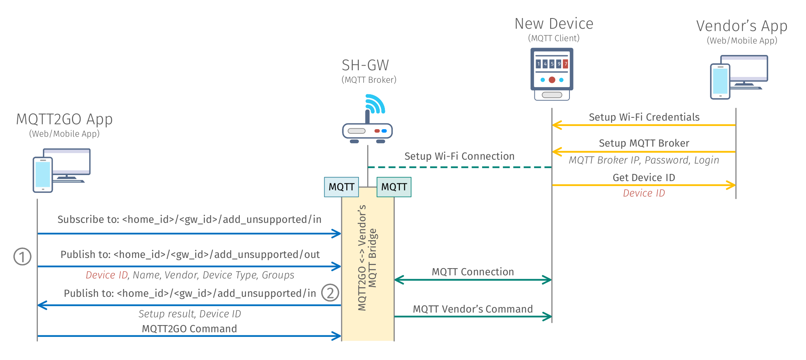

# Setup of New MQTT2GO Non-Compliant Devices
This setup is providing an example of adding a new non-MQTT2GO compliant device, which essentially means that the device manufacturer provided his own MQTT logic and topics and therefore does not want to adjust them to the MQTT2GO standard. To be still able to include this device into our MQTT2GO-enabled smart home, the following process is needed.

## Setup Steps

1. Turn on the MQTT Device that is going to be added.
1. Connect to the device's Wi-Fi network and set up it via the vendor provided App. This app is provided by every vendor for users to be able to setup the device comfortably.
1. Open the App that is compatible with the MQTT2GO standard and go through the add a new unsupported MQTT-enabled device. Insert there a Device ID provided by the vendor's App and complete the setup.
1. Now the device is successfully registered into our MQTT2GO ecosystem and can be controlled via the MQTT, this is possible due to the SH-GW containing multiple MQTT Brokers and a “translation middleware” which is utilized for translation of the MQTT commands between different topic and command structures.

	

	<em>Process of adding a new MQTT2GO non-compliant device.</em>

In the ideal world, the setup mentioned and depicted above can be simplified. This needs the cooperation of the vendor at the minimum possible part - the application provided by the vendor needs to be able to return an intent with the device ID. If this will be secured, then all the setup can be “fluid” from the users' point of view in the following manner.

## Setup Steps

1. The user will open the MQTT2GO App in which he will select add a new unsupported device.
1. A device manufacturer will be chosen in the MQTT2GO App, after which the corresponding application will be launched. In this application, user will set up the device as in the previous example, but the result will be sent back to the MQTT2GO App via the intent and therefore the user will be redirected back to the MQTT2GO App.
1. The device will be successfully added to the MQTT2GO ecosystem and is ready to be controlled.

[Back](./)
