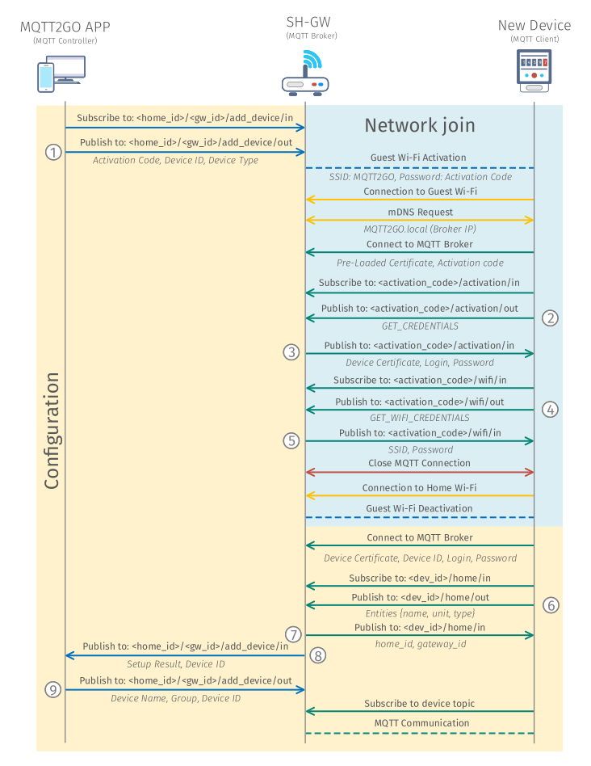

[Back](./index.md#add-devices)
# Setup via Guest WiFi
The ideal process of adding new device should be considered as the right way how to go through this process. Keeping this in mind, some of the steps detailed below can be reduced using a specific technology that can provide the needed functionality (i.e., WPS). The idealprocess to add a new device is based on the following steps.

## Setup Steps

1. MQTT Controller (Mobile/Web App) initiates the process of adding a new device by subscribing to __/user_id/gw_id/add_device__. Then it  publishes an activation request containing activation code. This code can be found on the newly installed device in the form of a number or QR code.
1. In response to the request, SH-GW enables the Guest Wi-Fi and sets the password inputted as an activation code.
1. MQTT end device then connects to the Guest Wi-Fi and further utilizes mDNS to resolve address __MQTT2GO.local__, which is the address of the MQTT broker.
1. The MQTT end device connects to the initialization MQTT broker with login MQTT2GO with a password corresponding to device activation code and subscribes to __/dev_id/activation topic__.
1. The end device then publishes __GET_ENCRYPTION_KEYS__ request to the same topic.
1. As a result, the MQTT broker publishes initial modulus __p__ and base __g__ together with its public encryption key __Key A__.
1. The end device as a response generates its private __Key B__ and publishes it to the shared topic. In this phase, both sides have a pair of public and private keys for encryption.
1. MQTT end device then subscribes to the __/dev_id/wifi topic__ and publishes __GET_WIFI_CREDENTIALS__ request.
1. MQTT broker responses to this request with a message containing credentials for home Wi-Fi encrypted with key established in the previous steps (128b AES cipher in CTR mode is used).
1. The end device closes the connection to the initialization MQTT broker and reconnects to the home Wi-Fi. As a result, the MQTT broker disables the Guest Wi-Fi, which is not needed at this time.
1. MQTT end device connects to the initialization broken one more time and subscribes to the __/dev_id/credentials__ topic.
1. The end device publishes __GET_MQTT_CREDENTIALS__ request and broker responses with login and password for the local MQTT broker. Credentials are encrypted with the key established in step 7.
1. MQTT end device closes the connection to the initialization broker and reconnects to the local broker with previously provided credentials.
1. The end device subscribes to __/dev_id/topics__ and publishes __GET_DEVICE_TOPICS__ request.
1. The user of the MQTT controller app is then requested to entitle the device and put it into the appropriate group. The controller app further publishes acquired data to the MQTT broker.
1. As a response, the MQTT broker sends a list of topics targeted for the end device.
1. The end device then subscribes to the received topics.
1. In the last phase, MQTT broker publishes the message containing type and the id of the newly added end device.
1. Further on, the end device communicates with the MQTT broker in a standardized manner.

	

	<em>Process of adding a new MQTT2GO device via guest WiFi.</em>

[Back](./index.md#add-devices)
