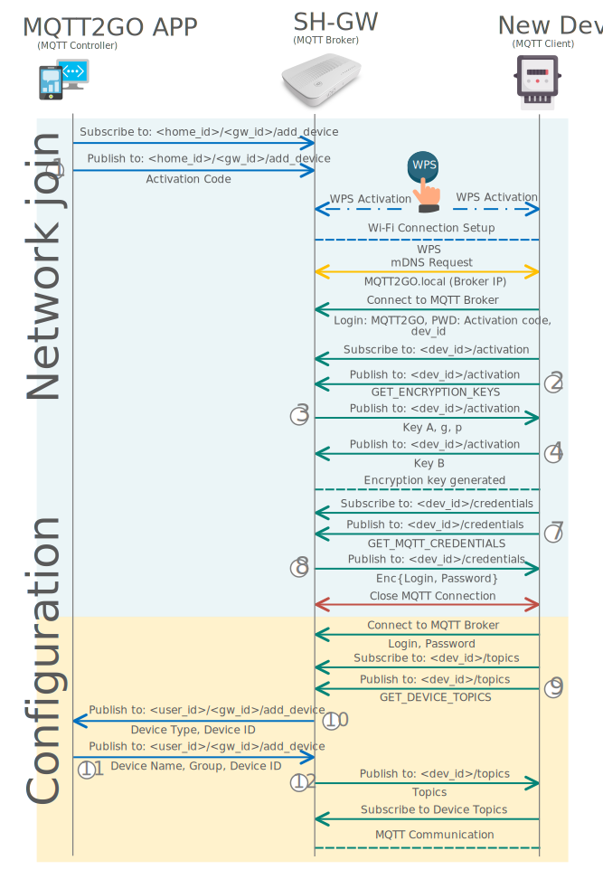

## Setup via WPS
The process of adding a new device using the WPS is very similar to the previous example. The only difference is that all the initial setup of the connection to the SH-GW is done via the WPS. The process of WPS is as follows: Both SH-GW and New Device has to activate the WPS at the same time. After the WPS is activated, the client-side device negotiates access with the access point and after the Wi-Fi connection is set up, the rest is the same as in the ideal example above.

1. MQTT Controller (Mobile/Web App) initiates the process of adding a new device by subscribing to __/user_id/gw_id/add_device__. Then it publishes an activation request containing activation code.  This code can be found on the newly installed device in the form of a number or QR code.
1. The user is prompted to activate WPS by pressing buttons on both SH-GW and newly installed end device.
1. MQTT end device automatically connects to the home Wi-Fi and further utilizes mDNS to resolve address __MQTT2GO.local__, which is the address of the MQTT broker.
1. The MQTT end device connects to the initialization MQTT broker with login MQTT2GO with a password corresponding to device activation code and subscribes to __/dev_id/activation__ topic.
1. The end device then publishes GET_ENCRYPTION_KEYS request to the same topic.
1. As a result, the MQTT broker publishes initial modulus __p__ and base __g__ together with its public encryption key __Key A__.
1. The end device as a response generates its private __Key B__ and publishes it to the shared topic. In this phase, both sides have a pair of public and private keys for encryption.
1. MQTT end device then subscribes to the __/dev_id/credentials__ topic and publishes __GET_MQTT_CREDENTIALS__ request.
1. MQTT broker responses with login and password for permanent device account. Credentials are encrypted with the key established in step 7.
1. MQTT end device closes the connection to the initialization broker and reconnects to the local broker with previously provided credentials.
1. The end device subscribes to __/dev_id/topics__ and publishes __GET_DEVICE_TOPICS__ request.
1. The MQTT broker publishes the message containing type and the id of the newly added end device.
1. The user of the MQTT controller app is then requested to entitle the device and put it into the appropriate group.  The controller app further publishes acquired data to the MQTT broker.
1. As a response, the MQTT broker sends a list of topics targeted for the end device.
1. The end device then subscribes to the received topics.
1. Further on, the end device communicates with the MQTT broker in a standardized manner.

	<em>Proccess of adding a new MQTT2GO Device using the WPS.</em>

[Back](./)