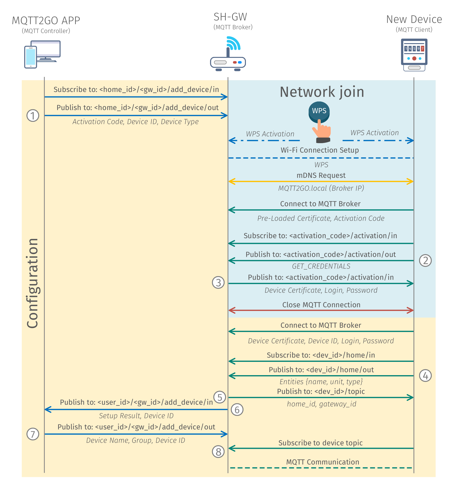

[Back](./index.md#add-devices)
# Setup via WPS

The process of adding a new device using the WPS is very similar to the previous example. The only difference is that all the initial setup of the connection to the SH-GW is done via the WPS. The process of WPS is as follows: Both SH-GW and New Device has to activate the WPS at the same time. After the WPS is activated, the client-side device negotiates access with the access point and after the Wi-Fi connection is set up, the rest is the same as in the ideal example.

## Setup Steps
1.	MQTT Controller (Mobile/Web App) initiates the process of adding a new device by subscribing to __/\<home_id\>/\<gw_id\>/add_device__. Then it publishes an activation request containing activation code and __device id__. These codes can be found on the newly installed device in the form number or QR code.
2.	The user is prompted to activate WPS by pressing buttons on both SH-GW and newly installed end device.
3.	MQTT end device then connects to the Home Wi-Fi and further utilizes mDNS (multicast DNS) to resolve address __MQTT2GO.local__, which equals to the address of the MQTT broker.
4.	The MQTT end device then connects to the initialization MQTT broker. The MQTT end device contains a pre-loaded certificate of trustworthy CA (Certification Authority), which is used to establish TLS (Transport Layer Security) communication with the MQTT broker. The chain of trust must be on both sides. Thus, the SH-GW (MQTT broker) has to contain a certificate issued by the same CA as it is contained in the MQTT end-device. If these certificates do not match, the TLS communication cannot be established.
5.	When the TLS communication is established the MQTT end device subscribes to the __\<activation_code\>/activation_ topic and publishes _GET_CREDENTIALS_ request.
6.	As a response, SH-GW (MQTT broker) generates a new set of certificates that will be used for ongoing communication and publishes its CA certificate to the MQTT end device.
7.	When the MQTT end device receives the certificate, a connection with the initialization broker is closed.
8.	Further MQTT end device connects to the MQTT broker with a certificate obtained in step 6 and subscribes to __\<device_id\>/topics__. The certificate from step 6 is directly connected to the __device id__. Thus only the device with proper __device id__ value can utilize this certificate. This approach brings additional security to the device configuration process.
9.	In the next step, the MQTT end device publishes _GET_DEVICE_TOPICS_ request.
10.	As a result, MQTT broker publishes the message to __\<home_id\>/\<gw_id\>/add_device__ topics with device type and __device id__ information.
11.	MQTT broker then expects a message from MQTT Controller with the end __device name__, __group__, and __id__.
12.	Based on the information from the previous step, the MQTT broker generates a topic structure for the end device and publishes the topics to the __\<dev_id\>/topics__.
13.	In this step, the MQTT end device subscribes to its topics, and all ongoing communication happens according to the MQTT2GO standard.

	

	<em>Process of adding a new WPS MQTT2GO device.</em>

[Back](./index.md#add-devices)
