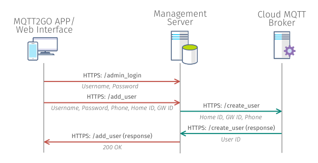
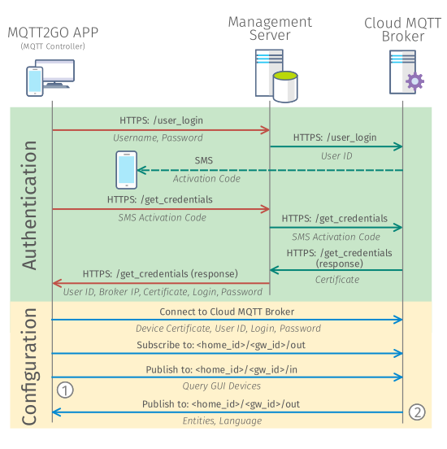

[Back](./index.md#add-devices)
# Setup new MQTT2GO Controller
<p align="justify" >
The MQTT2GO controllers are vital part of any MQTT2GO-enabled installation. They are the entry points for users that want to interact with the whole MQTT2GO ecosystem. This is true for all the MQTT2GO installations no matter if there is or is not the local MQTT2GO broker. It is worth mentioning, that the controllers can be also utilized as a "sniffers" for data mining applications.

From the perspective of the whole MQTT2GO communication infrastructure, the setup of the Controller brings one new element that have to be utilized. It is the Management Server, which has to be operated by the MQTT2GO adopter (service provider) and which contains all the necessary information about the MQTT brokers (ip addresses, names) and users. These users have to be created by the adopter authority as it is the only way how to maintain the security.

This section defines how the creation of a new MQTT2GO account and addition of a new MQTT2GO controller is done.
</p>

## Creation of new MQTT2GO account
<p align="justify" >
The new MQTT2GO account creation process utilizes credentials provided by the MQTT2GO standard adopter entity. They are meant to be provided after the initial client registration process into the adopter's system (e.g., network operator's accounting system). The creation process steps are following:
</p>

1. The MQTT2GO App / Web Interface connects to the management server via __HTTPS: /admin_login__ using the provided credentials (Username and Password).
1. The MQTT2GO App / Web Interface sends a request containing the Username, Password, Phone Number, Home ID, and GW ID to the Management server on the  __HTTPS: /add_user__.
1. Management server forwards this information to the correct MQTT2GO cloud broker, which then creates the user.

<p align="center" >
	
</p>
<p align="center" >
	<a name="create-account-fig"></a><em><strong>Fig. 1:</strong> Process of creating new MQTT2GO account.</em>
</p>

## Setup of new MQTT2GO controller
<p align="justify" >
The MQTT2GO controller creation process can be initialized only if at least one MQTT2GO account creation was successful. If this requirement is satisfied, created user is able to add a new MQTT2GO controllers and users to the system. It is also worthwhile to be noted, that in theory users can use the same username for multiple logins, but to deal with this problem is not in scope of the MQTT2GO standard. The MQTT2GO creation process is again utilizing the Management Server for user authentication. The reason to utilize it together with the MQTT2GO cloud broker is mainly the security. The process itself can be described in following steps:
</p>

1. The MQTT2GO app tries to connect to __HTTPS: /user_login__ using the user credentials (username and password).
1. If the credentials are valid, the management server forwards this request to the __HTTPS: / login_user__ of the MQTT2GO cloud broker and initializes the login process.
1. The MQTT2GO cloud broker then sends activation code via the SMS for client verification.
1. User enters this code into the third party platform, which then sends it into the __HTTPS: /get_platform_credentials__ of the management server.
1. The management server forwards the activation code to the __HTTPS: /get_credentials__ of MQTT2GO cloud broker.
1. The MQTT2GO cloud broker then sends the certificate to the __HTTPS: /post_credentials__ of the management server.
1. The management server then sends a response with user ID, broker IP, certificate, login, and password to the __HTTPS: /get_credentials__ from which the MQTT2GO app saves it.
1. The MQTT2GO app connects to the MQTT2GO cloud broker using the provided __certificate__,  __user ID__, __login__, __password__, and __broker IP__.
1. The MQTT2GO app subscribes to the __\<home_id\>/<gw_id\>/out__ and publishes a __QUERY_GUI_DEV__ message to __\<home_id\>/<gw_id\>/in__.
1. The MQTT2GO cloud broker publishes to the __\<home_id\>/<gw_id\>/out__ message with all available MQTT2GO entities and its language. Based on the entities, the controller subscribes to all their topics.
1. From now on, the MQTT communication follows the MQTT2GO standard.

<p align="center" >
	
</p>
<p align="center" >
	<a name="add-devices-fig"></a><em><strong>Fig. 2:</strong> Process of login into MQTT2GO account (adding new MQTT2GO controller).</em>
</p>

<p align="justify" >
This procedure is presented as the ideal implementation of the controller creation. If the user wants to utilize third party MQTT client, the green part (Authentication) that is exploited for, broker IP and certificate obtaining has to be implemented or used separately (i.e., using the web browser). 
</p>

### User authentication
<p align="justify" >
The user authentication operation inside MQTT2GO controller creation is utilizing the HTTPS API and therefore does not follow the MQTT2GO topic naming convention. The reason for this is to simplify the access process of a service, which will be utilized only several times. 
</p>

## HTTPS API message structure
<p align="justify" >
Even though the HTTPS API is not adhering to the topic naming convention, it still utilizes the JSON data structure of the messages. This section provides examples of all utilized messages.
</p>

### user_login
<p align="justify" >
This message contains information about the user credentials. Its structure is following:
</p>

```json
{	
	"username": "username",
	"password": "pwd"
}
```

## Configuration
<p align="justify">
This section is utilizing the standard MQTT2GO topic naming structure together with standard MQTT2GO messages. They are described in following section.
</p>

### MQTT Commands
<p align="justify">
In this specific implementation, there is only one MQTT2GO command and its primary goal is to request all device topics to which the controller have to subscribe. This secures the controller to be able to control all devices, to which the selected user has access. The command structure is based on the structure from <a href="./mqtt2go-commands#mqtt_commands">MQTT Commands</a>. The numbering in this section is coherent with the numbering in <a href="#add-devices-fig">Fig. 2</a>.
</p>

#### Get Entities
```
<home_id>/<gw_id>/in
```
```json
{
    "timestamp": "timestamp_value",
    "type": "user_entities",
    "value": "user_id"
}
```

### MQTT Reports
<p align="justify">
The MQTT reports presented here are designed as “responses” to aforementioned commands. Their structure is also coherent with the general structure from <a href="./mqtt2go-commands#mqtt_reports">MQTT Reports</a> and the numbering is matching the one in <a href="#add-devices-fig">Fig. 2</a>.
</p>

#### Get entities
<p align="justify">
This report is utilized for requesting all necessary information from the smarthome gateway. The report contains topics and information about all devices, configured scenes and security features, as well as alerts and home layout.
</p>

```
<home_id>/<gw_id>/id/out
```
```json
{
    "timestamp": "timestamp_value",
    "type": "command_response",
    "home_prefix": "baseline_topic_value",
    "language": "language",
    "value": {
        "scenes":[
            {
                "id": "id_value",
                "name": "name_value",
                "icon": "icon_value",
                "active": "active_state_value"
            }, ...
        ],
        "alert":[
            {
                "event_name": "event_name_value",
                "message": "message_value",
                "status":"status_value",
                "timestamp": "timestamp_value"
            }, ...
        ],
        "security":[
             {
                "id":"id_value",
                "type":"type_value",
                "name":"name_value",
                "icon":"icon_value",
                "active": "active_state_value"
             }, ...
         ],
         "activities":[
         
        ],
        "rooms":[
         {
            "id":"room_id_value",
            "devices":[
               {
                  "id":"id_value",
                  "name":"name_value",
                  "type":"type_value",
                  "image":"image_location",
                  "events":{
                     "message":"message_value",
                     "timestamp":"timestamp_value"
                  }
               }
            ], ...
        }, ...
    }
}
```

[Back](./index.md#add-devices)
