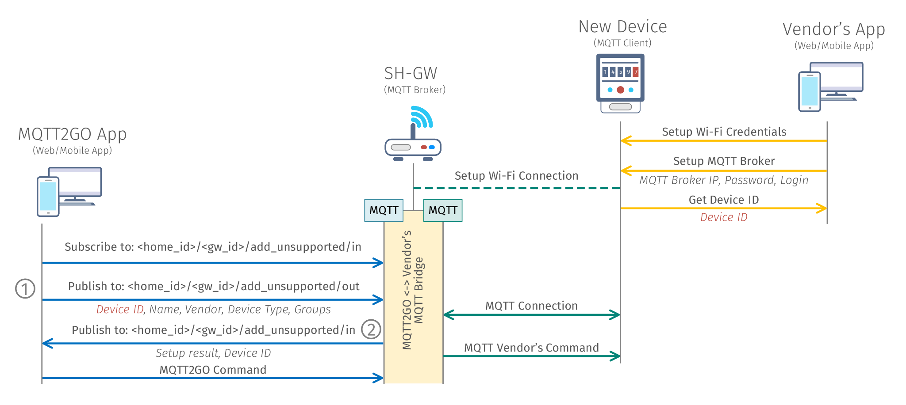

[Back](./index.md#add-devices)
# Setup of New MQTT2GO Non-Compliant Devices
<p align="justify">
This setup is providing an example of adding a new MQTT2GO non-compliant device, which essentially means that the device manufacturer provided his own MQTT logic and topics, which are different to the MQTT2GO standard. To be still able to include this device into our MQTT2GO-enabled smart home, the following process is needed.
</p>

## Setup Steps
1. Turn on the MQTT device that is going to be added.
2. Connect to the device's Wi-Fi network and set up it via the vendor app. This app is provided by every vendor for users to be able to setup the device comfortably.
3. Open the App that is compatible with the MQTT2GO standard and go through the add a new unsupported MQTT-enabled device. Insert there a __device ID__ (provided by the vendor's app), device vendor, device type, and groups and complete the setup. In this step, the MQTT2GO Controller app subscribes to __\<home_id\>/\<gw_id\>/add_unsupported/in__ topic and publishes inserted data to __\<home_id\>/\<gw_id\>/add_unsupported/out__ topic.
4. The MQTT2GO app waits for the newly added device to connect to the SH-GW broker.
5. Now the device is successfully registered into our MQTT2GO ecosystem and can be controlled via the MQTT, this is possible due to the SH-GW containing multiple MQTT Brokers and a “translation middleware”, which is utilized for translation of the MQTT commands between different topic and command structures.

<p align="center" >
	
</p>
<p align="center" >
	<a name="add-devices-fig"></a><em><strong>Fig. 1:</strong> Process of adding a new MQTT2GO non-compliant device.</em>
</p>

<p align="justify">
In the ideal world, the setup mentioned and depicted above can be simplified. This needs the cooperation of the vendor at the minimum possible part - the application provided by the vendor needs to be able to return an intent with the device ID. If this is secured, then all the setup can be “fluid” from the users' point of view in the following manner.
</p>

## Optimized Setup Steps
1. The user will open the MQTT2GO App in which he will select add a new unsupported device.
2. A device manufacturer will be chosen in the MQTT2GO App, after which the corresponding application will be launched. In this application, user will set up the device as in the previous example, but the result will be sent back to the MQTT2GO App via the intent and therefore the user will be redirected back to the MQTT2GO App.
3. The MQTT2GO app waits for the newly added device to connect to the SH-GW broker.
4. The device will be successfully added to the MQTT2GO ecosystem and is ready to be controlled.


## Device Configuration
<p align="justify">
Since the end device is not MQTT2GO compliant, the whole process cannot be automatized as in other cases. Therefore tho whole topic and command structure is limited to the one topic and command.
</p>

### Topic Structure
<p align="justify">
This topic is utilized to add the unsupported device to the system.
</p>

```
<home_id>/<gw_id>/add_unsupported/<msg_direction>
```

### MQTT Command
<p align="justify">
The MQTT broker has no chance to determine what kind of device is added. Therefore the command contains information about the device vendor and device type, which allows MQTT broker to determine the topics which device subscribes to.
</p>

```json
{
	"type": "rename_device",
	"timestamp": "timestamp_value",
	"value": {
		"device_id": "device_id",
		"device_vendor": "device_type",
		"device_name": "device_name",
		"group_id": ["group_id_1", "group_id_2", ...]
	}
}
```

[Back](./index.md#add-devices)
