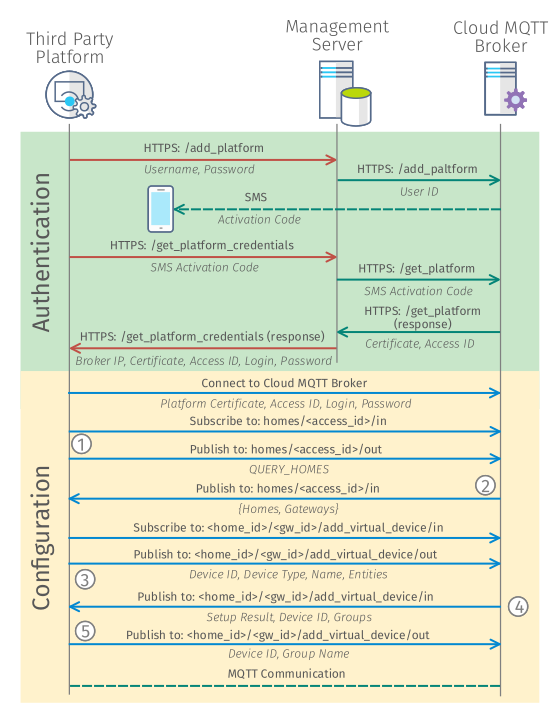

[Back](./index.md#add-devices)

# Setup New MQTT2GO Virtual Device

The MQTT2GO virtual devices are utilized for incorporation of devices from other services or purely software devices. This way, we can secure a separate process to add non-standard (software) devices into the MQTT2GO standard. As it will be described in the following text, this procedure expects the adopters to implement part of the proccess on their side, without which the whole setup process would not work.

## Creation of new MQTT2GO Virtual device
This section describes the procedure of creating a new MQTT2GO virtual device. Each step is separately defined to avoid confusion while implementing:

1. The third party platform tries to connect to __HTTPS: /add_platform__ using the user credentials (username and password).
1. If the credentials are valid, the management server forwards this request to the __HTTPS: /add_platform__ of the MQTT2GO cloud broker and initializes the login process.
1. The MQTT2GO cloud broker then sends activation code via the SMS for client verification.
1. User enters this code into the third party platform, which then sends it into the __HTTPS: /get_platform_credentials__ of the management server.
1. The management server forwards the activation code to the __HTTPS: /get_platform__ of MQTT2GO cloud broker.
1. The MQTT2GO cloud broker then sends the certificate to the __HTTPS: /get_platform__ of the management server.
1. The management server then sends a response with user ID, broker IP, certificate, login, and password to the __HTTPS: /get_platform/credentials__ from which the third party platform saves it.
1. The third party platform connects to the MQTT2GO cloud broker using the provided __certificate__,  __access ID__, __login__, __password__, and __broker IP__.
1. The third party platform subscribes to the __homes/\<access_id\>/in__ and publishes a __QUERY_HOMES__ message to __homes/access_id/out__.
1. The MQTT2GO cloud broker publishes to the __homes/\<access_id\>/in__ message with all available MQTT2GO homes and their respective gateways. 
1. The third party platform subscribes to the __\<home_id\>/\<gw_id\>/add_virtual_device/in__ and publish message with device ID, device type, name, entities to the __\<home_id\>/\<gw_id\>/add_virtual_device/out__.
1. The third party platform receives setup result, device id, and groups. Then it publishes device_id and group name to __\<home_id\>/\<gw_id\>/add_virtual_device/out__.
1. Based on the entities, the controller subscribes to all their topics. From now on, the MQTT communication follows the MQTT2GO standard.

	

	<em><strong>Fig. 1:</strong> Process of creating new MQTT2GO Virtual Device.</em>

