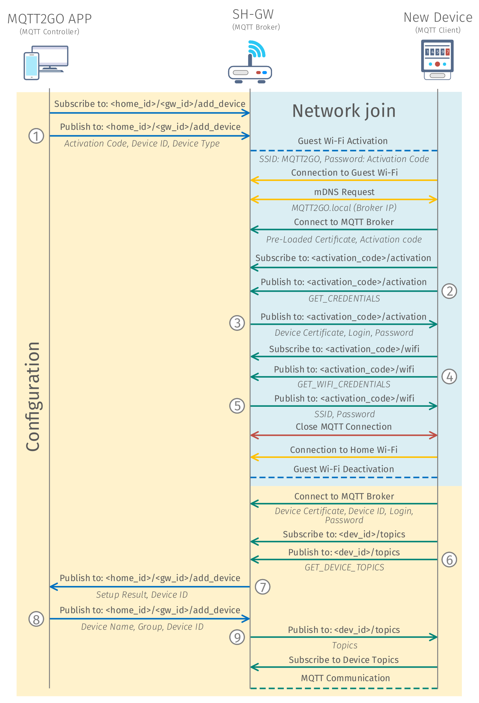

[Back](./index.md#add-devices)
# Setup via Guest WiFi
<p align="justify" >
The ideal process of adding new device should be considered as the right way how to go through the setup procedure. Keeping this in mind, some of the steps detailed below can be reduced using a specific technology that can provide the needed functionality (i.e., WPS). The ideal process to add a new device is based on the following steps.
</p>

## Setup Steps

1.	MQTT Controller (Mobile/Web App) initiates the process of adding a new device by subscribing to __/\<home_id\>/\<gw_id\>/add_device__. Then it publishes an activation request containing __activation code, device id__, and __device type__. The __activation code__ and __device id__ codes can be found on the newly installed device in the form of two numbers or QR codes.
2.	In response to the request, SH-GW enables the Guest Wi-Fi with SSID of __MQTT2GO__ and the inputted activation code as password.
3.	MQTT end device then connects to the Guest Wi-Fi and further utilizes mDNS (multicast DNS) to resolve address __MQTT2GO.local__ (\_mqtt.\_tcp.local.), which equals to the address of the MQTT broker.
4.	The MQTT end device then connects to the initialization MQTT broker. The MQTT end device contains a pre-loaded certificate fingerprint of trustworthy CA (Certification Authority), which is used to establish TLS (Transport Layer Security) communication with the MQTT broker. The chain of trust must be on both sides. Thus, the SH-GW (MQTT broker) has to contain a certificate issued by the same CA as it is contained in the MQTT end-device. If these certificates do not match, the TLS communication cannot be established and the device will be refused as a non-trustworthy.
5.	When the TLS communication is established the MQTT end device subscribes to the __\<activation_code\>/activation__ topic and publishes _GET_CREDENTIALS_ request.
6.	As a response, SH-GW (MQTT broker) generates a new set of certificates that will be used for ongoing communication and publishes its CA certificate, login, and password to the MQTT end device.
7.	The MQTT end device further subscribes to __\<activation_code\>/wifi__ and publishes _GET_WIFI_CREDENTIALS_ request.
8.	In response, the MQTT broker issues Wi-Fi credentials (SSID, Password) for the home network.
9.	When the MQTT end device receives the credentials, connection with the initialization broker is closed. The end device then connects to the home Wi-Fi with the acquired credentials.
10.	Further MQTT end device connects to the MQTT broker with a certificate and credentials obtained in step 6 and subscribes to __\<dev_id\>/topic__.
11.	In the next step, the MQTT end device publishes _GET_DEVICE_TOPIC_ request. The certificate from step 6 is directly connected to the __device id__. Thus only the device with proper __device id__ value can utilize this certificate. This approach brings additional security to the device configuration process.
12.	As a result, MQTT broker publishes the message to __\<home_id\>/\<gw_id\>/add_device__ topic with __device id__ information to distinguish individual devices.
13.	MQTT broker then expects a message from MQTT Controller with the end device __name__, __group__, and __id__.
14.	Based on the information from the previous step, the MQTT broker generates a topic structure for the end device and publishes the device topic to the __\<home_id\>/\<gw_id\>\<dev_id\>/topic__.
15.	In what follows, the MQTT end device subscribes to its topic, and all ongoing communication happens according to the MQTT2GO standard.


<p align="center" >
	
</p>
<p align="center" >
	<a name="add-devices-fig"></a><em><strong>Fig. 1:</strong> Process of adding a new MQTT2GO device via guest WiFi.</em>
</p>

## Network Join
<p align="justify">
The operation of adding a new device into the network / household is exploiting a special topics. These topics are only temporary and utilized only for this specific use-case. This means that, aside from one, they are not a part of the standard topic structure. This simplifies the implementation at the end devices as they initially have no idea about the current topic structure of the MQTT2GO household. This topics and their specific commands and reports are described in this section.
</p>

### Topics Structure
<p align="justify">
As aforementioned, network join topics are unique inside the MTT2GO standard and are solely used for the initial connection of new devices. Their structure is given in following subsections.
</p>

#### End device
<p align="justify">
The end device itself utilizes a two unique topics for the initialization communication. They are:
</p>

```
<activation_code>/activation
```
exploited for certificate exchange, and

```
<activation_code>/wifi
```
for the Wi-Fi credentials exchange.

### MQTT Commands
<p align="justify">
The MQTT commands for the network join are again based on the general structure from <a href="./mqtt2go-commands#mqtt_commands">MQTT Commands</a>. The most important difference lies in the <i>value</i> key of the command, which can be further divided by the function of the command message (the numbering here corresponds to the one in <a href="#add-devices-fig">Fig. 1</a>).
</p>

#### Get Credentials
<p align="justify">
This command (2) is utilized to get a newly generated certificate for the end device. Its command <i>value</i> is in form of string with value <em>GET_CREDENTIALS</em>.
</p>

```json
{
	"timestamp": "timestamp_value",
	"value": "GET_CREDENTIALS"
}
```

#### Get Wifi Credentials
<p align="justify">
Get Wifi credentials (4) which is used to obtain the Wi-Fi credentials, again the command <i>value</i> is <em>GET_WIFI_CREDENTIALS</em> string.
</p>

```json
{
	"timestamp": "timestamp_value",
	"value": "GET_WIFI_CREDENTIALS"
}
```

### MQTT Reports
<p align="justify">
These reports are specifically designed for the initialization process of the network join. They again follow the general structure from <a href="./mqtt2go-commands#mqtt_reports">MQTT Reports</a>, and they are labeled with numbers that correspond to the <a href="#add-devices-fig">Fig. 1</a>.
</p>

#### Credentials
This report (3) is utilized to deliver a newly generated certificate from MQTT broker to the end device.

```json
{
	"report_type":"command_response",
	"timestamp": "timestamp_value",
	"value":  {
		"cert": "device_certificate",
		"user": "mqtt_login",
		"password": "mqtt_password"
	}
}
```

#### Wi-Fi Credentials
<p align="justify">
This report (5) is used to send the Wi-Fi credentials back to the end device.
</p>

```json
{
	"timestamp": "timestamp_value",
	"report_name": "wifi_credentials",
	"value": {
		"SSID": "wifi_ssid",
		"password": "password"
	}
}
```

## Device Configuration
<p align="justify">
The device configuration is happening over topics that are unique to each device. This way it is secured that all the configuration will be done to the correct device. The only exception is the initialization process, where the topic is universal for the whole process, but in this case it is secured via the ability of adding only one device at a time.
</p>

## Topics Structure
<p align="justify">
The topics for the device configuration presented in this section are for the initial device configuration only. The device update and similar topics are presented in <a href="./mqtt2go-objects">MQTT Objects</a> section. Here, the topics are divided into two parts depending on which device is utilizing them.
</p>


#### Controlling App / SH-GW
<p align="justify">
The controlling App / SH-GW utilizes a special topic for the addition of new devices. This topic is structured as follows:
</p>

```
<home_id>/<gw_id>/add_device
```

<p align="justify">
Its main purpose is to publish information that initialize and finalize the adding process.
</p>

#### End Device
<p align="justify">
The end device utilizes following topic to get the topic name to which the devices has to be subscribed to.
</p>

```
<dev_id>/topic
```

### MQTT Commands
<p align="justify">
The MQTT Commands mentioned below are used in adding a new device process. The command structure is based on the structure from <a href="./mqtt2go-commands#mqtt_commands">MQTT Commands</a>. Again, the numbering in this section is coherent with the numbering in <a href="#add-devices-fig">Fig. 1</a>.
</p>

#### Add New Device
<p align="justify">
This command (1) is utilized to start the whole process of adding a new device. The command contains the <strong>activation_code</strong>, <strong>device_id</strong>, and <strong>device_type</strong> of the newly added device.
</p>

```json
{
	"timestamp": "timestamp_value",
	"value": {
		"activation_code": "activation_code",
		"device_id": "device_id",
		"device_type": "device_type"
	}
}
```

#### Get Device Topic
<p align="justify">
Get device topic command (6) is used to get device topic from the SH-GW. This command has value of <em>GET_DEVICE_TOPIC</em>.
</p>

```json
{
	"timestamp": "timestamp_value",
	"value": "GET_DEVICE_TOPIC"
}
```

#### Rename Device
<p align="justify">
This command (8) is utilized to finalize the process of adding a new device to the system. Via this command, the end device gains its name and inclusion to the groups.
</p>

```json
{
	"timestamp": "timestamp_value",
	"value": {
		"device_id": "device_id",
		"device_name": "device_name",
		"group_id": ["group_id_1", "group_id_2", ...]
	}
}
```

### MQTT Reports
<p align="justify">
The MQTT reports presented here are designed as a “responses” to aforementioned commands. Their structure is also coherent with the general structure from <a href="./mqtt2go-commands#mqtt_reports">MQTT Reports</a> and the numbering is matching the one in <a href="#add-devices-fig">Fig. 1</a>.
</p>


#### Rename Device
<p align="justify">
This report (7) is utilized to request the user of the <a href="./mqtt2go-controllers">MQTT2GO Controller</a> app for the name and group of the newly added device.
</p>

```json
{
	"report_type":"command_response",
	"timestamp": "timestamp_value",
	"value": {
		"device_id": "device_id",
		"setup_result": "setup_result"
	}
}
```

#### Device Topic
<p align="justify">
This report (9) is used to deliver the requested topic, in which the new device is intended to subscribe.
</p>

```json
{
	"report_type":"command_response",
	"timestamp": "timestamp_value",
	"report_name": "topic",
	"value": "topic"
}
```

[Back](./index.md#add-devices)
