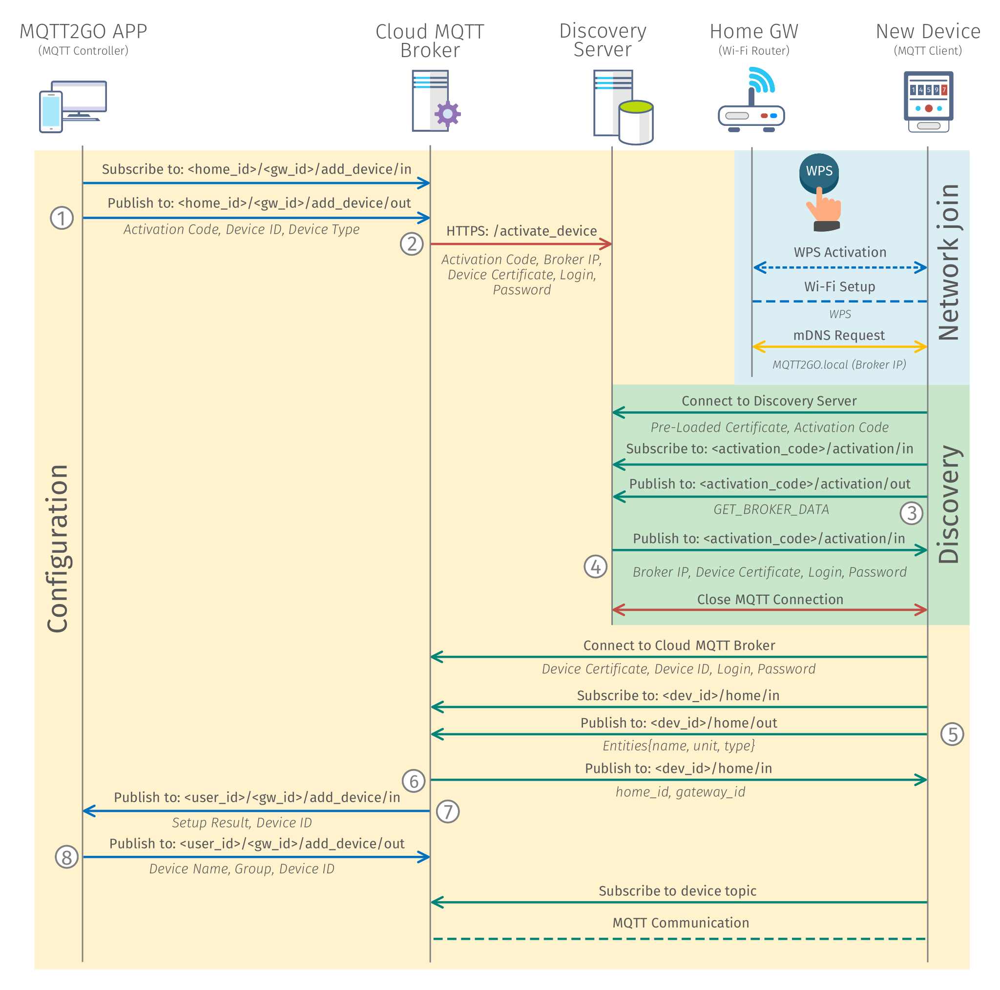

[Back](./index.md#add-devices)
# Setup via WPS with Remote Broker
<p align="justify">
On top of the typical Smart-Home paradigm with a SH-GW acting as a centerpiece of all communication, MQTT2GO also offers to offload this functionality to the cloud. The local network then does not contains any local MQTT broker, but the whole communication is handled in the cloud. Nevertheless, none of the features of the local broker is missing, and the transition is seamless from the perspective of the end user / end device.	
</p>

<p align="justify">
From the perspective of the whole communication infrastructure, one new element is required to be present. This element is called the Discovery server and allows end devices to discover the address of the cloud MQTT broker. Further, an additional communication channel between the cloud broker and the Discovery server is needed, as it will be described in the following text.
</p>

<p align="justify">
The following steps cover the optimal case with WPS functionality. When the WPS is not present, the process is more complicated and requires additional user interaction. These steps mainly consist of delivering the SSID and password of home Wi-Fi.
</p>

## Setup Steps
1.	MQTT Controller (Mobile/Web App) initiates the process of adding a new device by subscribing to __/\<home_id\>/\<gw_id\>/add_device/in__. Then it publishes an activation request containing __activation code__ and __device id__ to __/\<home_id\>/\<gw_id\>/add_device/out__. These codes can be found on the newly installed device in the form of two unique numbers identifying the device or as QR code.
2.	The cloud MQTT broker then contacts the Discovery server and adds the newly installed device into the database of devices waiting for activation. The communication is conducted via __REST API__ over HTTPS protocol. All data including cloud MQTT __broker IP__, __activation code__ and newly generated __certificate__, __login__, and __password__ are delivered to the __/activate_device__ endpoint. The device is not stored in the database permanently, but it is removed after 15 minutes. This approach limits the time window during which the device can be activated, but also adds an additional level of security.
3.	In the meantime, the MQTT end device connects to the home Wi-Fi via WPS and looks for the network for the __MQTT2GO.local__ (\_mqtt.\_tcp.local.) activation server address.
4.	When the MQTT broker is not found in the local network, end device (ED) contacts the Discovery server. The address of the server is pre-loaded in the device during the manufacturing process.
5.	The ED utilizes the pre-loaded certificate together with the activation code to connect to the MQTT broker on the Discovery server. As in the case of other activation procedures, the certificate of the server must be issued by the same CA (Certification Authority). Otherwise, the TLS (Transport Layer Security) communication cannot be established.
6.	Further, the end device subscribes to the __\<activation_code\>/activation/in__ topic and publishes the _GET_BROKER_DATA_ request.
7.	As a response, MQTT broker on the Discovery server delivers the cloud __broker IP__, __login__, __password__, and the new __certificate__ obtained in the step 5. The end device further closes the connection to the MQTT broker on the Discovery server.
8.	Then the end device connects to the remote MQTT broker with the certificate and credentials from the previous step and subscribes to __\<dev_id\>/home/in__.
9.	In the next step, the MQTT ED publishes request of the _home_prefix_ type to __\<dev_id\>/home/in__ topic that contains all entities the ED provides with additional information on its data type and unit.
10.	The SH-GW publishes _home_id_ and _gw_id_ to __\<dev_id\>/home/in__.
11.	As a result, MQTT broker publishes the message to __\<home_id\>/\<gw_id\>/add_device/in__ topic with __device id__ information to distinguish individual devices.
12.	MQTT broker then expects a message from MQTT Controller with the end device __name__, __group__, and __device_id__.
13.	In what follows, the MQTT end device subscribes to its topic, and all ongoing communication happens according to the MQTT2GO standard.


<p align="center" >
	
</p>
<p align="center" >
	<a name="add-devices-fig"></a><em><strong>Fig. 1:</strong> Process of adding a new MQTT2GO device with remote (cloud) broker.</em>
</p>

## Network Join
<p align="justify">
In this phase, no MQTT communication takes place, and the whole process consists of network join via the WPS process.
</p>

## MQTT Broker Discovery
<p align="justify">
The operation of adding a new device into the network / household is utilizing a special topics. These topics are only temporary and utilized only for this specific use-case. This means that, aside from one, they are not a part of the standard topic structure. This simplifies the implementation at the end devices as they have no idea of the current structure of the MQTT2GO household. The topics, commands, and reports needed for discovery of remote MQTT broker are described in this section.
</p>

### MQTT Commands
<p align="justify">
The MQTT commands for the network join are again based on the general structure from <a href="./mqtt2go-commands#mqtt_commands">MQTT Commands</a>. And the most important change is in the value of the command, which can be further divided by the function of the message (the numbering here corresponds to the one in <a href="#add-devices-fig">Fig. 1</a>).
</p>

#### Get Remote Broker Data
<p align="justify">
This command (3) is utilized to get the address of remote broker together with a newly generated certificate for the end device. Its command value is in form of string with value <em>GET_BROKER_DATA</em>.
</p>

```json
{
	"timestamp": "timestamp_value",
	"value": "GET_BROKER_DATA"
}
```

### MQTT Reports
<p align="justify">
These reports are specifically designed for the initialization process of remote broker discovery. Again the process follows the general structure from <a href="./mqtt2go-commands#mqtt_reports">MQTT Reports</a>. They are again labeled with numbers that are corresponding to the <a href="#add-devices-fig">Fig. 1</a>.
</p>

#### Remote Broker Data
This report (4) is utilized to deliver a newly generated certificate from MQTT broker to the end device.

```json
{
    "type": "broker_data",
	"timestamp": "timestamp_value",
	"value": {
		"broker_ip": "broker_ip",
		"device_certificate": "device_certificate",
		"user": "mqtt_login",
		"password": "mqtt_password"
	}
}
```


## Device Configuration
<p align="justify">
The device configuration is happening over topics that are unique to this only process. To secure that the configuration will be done to the intended device, a unique <strong>device_ids</strong> is utilized during the process. 
</p>

### Topics Structure
<p align="justify">
The topics for the device configuration presented in this section are for the initial device configuration only.
</p>

### MQTT Commands
<p align="justify">
The MQTT Commands mentioned below are used in adding a new device process. The command structure is based on the structure from <a href="./mqtt2go-commands#mqtt_commands">MQTT Commands</a>. Again, the numbering in this section is coherent with the numbering in <a href="#add-devices-fig">Fig. 1</a>.
</p>

#### Add New Device
<p align="justify">
This command (1) is utilized to start the whole process of adding a new device. The command contains the <strong>activation_code</strong>, <strong>device_id</strong>, and <strong>device_type</strong> of the newly added device.
</p>

```
<home_id>/<gw_id>/add_device/out
```

```json
{
	"timestamp": "timestamp_value",
	"value": {
		"activation_code": "activation_code",
		"device_id": "device_id",
		"device_type": "device_type"
	}
}
```

#### Get Home Prefix
<p align="justify">
In case of Get Home Prefix (6), which is used to obtain the home prefix, that consists of <em>home_id</em> and <em>gateway_id</em>. The command <i>value</i> consists of array of the available topic names of the current device, together with unit name and type.
</p>

```
<device_id>/home/out
```

```json
{
    "timestamp": "timestamp_value",
    "type": "home_prefix",
    "value": [
      {"name": "topic_name",
       "unit": "unit_quantity",
       "type": "unit_datatype"
      }, ...   
    ]
}
```

#### Rename Device
<p align="justify">
This command (9) is utilized to finalize the process of adding a new device to the system. Via this report, the end device gains its name and inclusion to the groups.
</p>

```
<home_id>/<gw_id>/add_device/out
```

```json
{
	"timestamp": "timestamp_value",
	"value": {
		"device_id": "device_id",
		"device_name": "device_name",
		"group_id": ["group_id_1", "group_id_2", ...]
	}
}
```

### MQTT Reports
<p align="justify">
The MQTT reports presented here are designed as “responses” to aforementioned commands. Their structure is also coherent with the general structure from <a href="./mqtt2go-commands#mqtt_reports">MQTT Reports</a> and the numbering is matching the one in <a href="#add-devices-fig">Fig. 1</a>.
</p>

#### Home Prefix Report
<p align="justify">
The home prefix report (7) consists of <em>home_id</em> and <em>gateway_id</em>.
</p>

```
<device_id>/home/in
```

```json
{
    "timestamp": "timestamp_value",
    "type": "home_prefix",
    "value": {
      "home_id": "home_id_value",
       "gateway_id": "gateway_id_value"
    }
}
```

#### Rename Device Report
<p align="justify">
This report (8) is utilized to request the user of the <a href="./mqtt2go-controllers">MQTT2GO Controller</a> app for the name and group of the newly added device.
</p>


```
<home_id>/<gw_id>/add_device/in
```

```json
{
	"timestamp": "timestamp_value",
	"value": {
		"device_id": "device_id",
		"setup_result": "setup_result"
	}
}
```

[Back](./index.md#add-devices)
