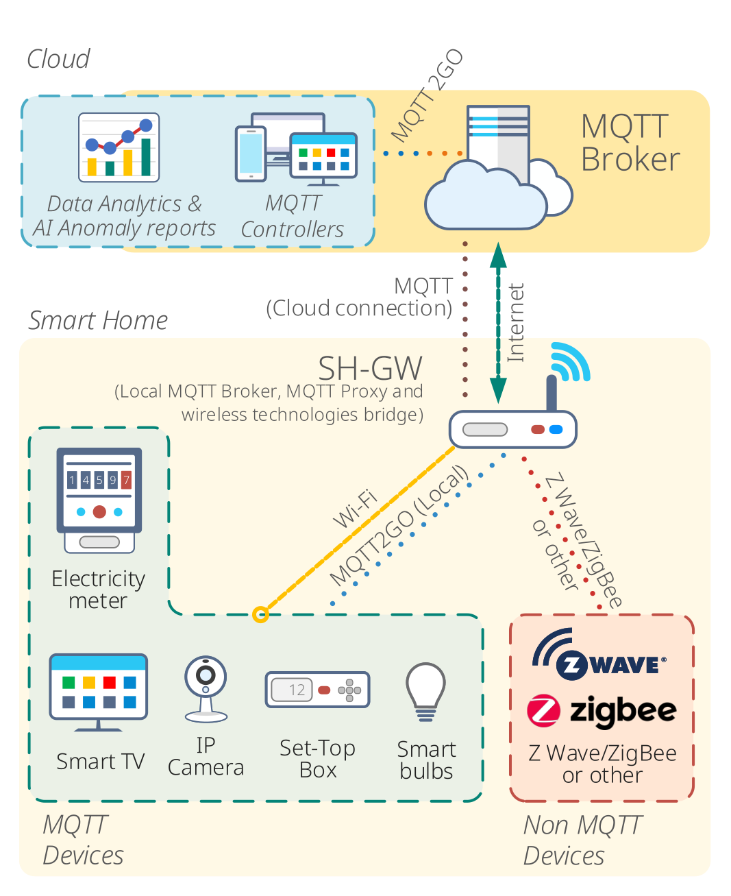
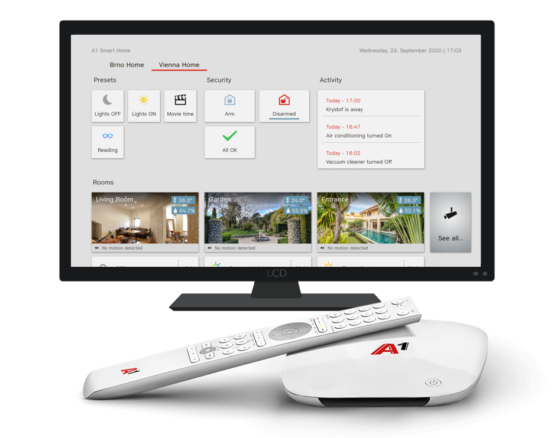

# Release Versions

<table style="width:100%">
    <tr>
        <th style="width:20%">Date</th>
        <th style="width:10%">Revision</th>
        <th style="width:60%">Description</th>
        <th style="width:10%">Changelog</th>
    </tr>
    <tr>
        <td>2020-09-30</td>
        <td>Rev 2.0</td>
        <td>A significant change in topic structure. Commands and reports are distinguished by in and out directions. Updated adding procedure of all devices. New MQTT2GO compliant devices were added.</td>
        <td><a href="https://mqtt2go.github.io/changelog">Changelog</a></td>
    </tr>
    <tr>
        <td>2020-04-02</td>
        <td><a href="https://mqtt2go.github.io/1.2/index">Rev 1.2</a></td>
        <td>New version where sections "MQTT2GO objects" and "MQTT2GO Compatible Devices" are added. Also, the naming conventions were updated as well as the "device adding procedure" has been updated.</td>
        <td><a href="https://mqtt2go.github.io/1.2/changelog">Changelog</a></td>
    </tr>
    <tr>
        <td>2019-11-21</td>
        <td><a href="https://mqtt2go.github.io/1.1/index">Rev 1.1</a></td>
        <td>Updated version of the MQTT2GO standard</td>
        <td><a href="https://mqtt2go.github.io/1.1/changelog">Changelog</a></td>
    </tr>
    <tr>
        <td>2019-11-13</td>
        <td><a href="https://mqtt2go.github.io/1.0/index">Rev 1.0</a></td>
        <td>Initial version of the MQTT2GO standard</td>
        <td><a href="https://mqtt2go.github.io/1.0/changelog">Changelog</a></td>
    </tr>
    <tr>
        <td>-</td>
        <td><a href="https://mqtt2go.github.io/dev/index">DEV</a></td>
        <td>Unpublished development version</td>
        <td><a href="https://mqtt2go.github.io/dev/changelog">Changelog</a></td>
    </tr>
</table>

# The MQTT2GO Project Introduction

 When talking about the Internet of Things (IoT), communication is always mentioned in the first place. Interaction between sensors, devices, gateways, and user applications is the essential characteristic that creates the IoT landscape. But what enables all this smart stuff to talk and interact? To exchange the data, the IoT protocols are those enablers which can be seen as languages that the IoT devices use in order to communicate. Out of these transferred pieces of data, useful information can be extracted for the customers and thanks to it, the whole deployment turns into the working ecosystem.

Nevertheless, the wide variety of currently available IoT protocols creates a need for standardized means of IoT communication. They should help to avoid further fragmentation of the market, thus minimizing the risk of the incompatibility and security threats. While it seems that this is an statement which all agree on, few efforts have been made so far to propose a world-wide standard that would unify all IoT communication.

Therefore, the main goal of the MQTT2GO project is to investigate one of the most emerging IoT protocol i.e., Message Queuing Telemetry Transport (MQTT) for Smart Home scenarios, in which all the communication is done using the protocol in question. Based on the key findings gained during the thorough market overview, the introduced MQTT2GO-enabled proof-of-concept demonstrator is capable of handling both the MQTT devices (i.e., sensors) and MQTT controllers, see the figure "Architecture of MQTT2GO System." As the MQTT protocol provides a lightweight method of carrying out messaging using a publish / subscribe model, it is well suited for IoT messaging such as with low power sensors or mobile devices like smartphones, embedded devices, home dashboards, etc.

The introduced MQTT2GO standard manages to handle also the non-MQTT devices, which can be also part of the Smart Home scenario. Relying on the current ICT trends, the MQTT2GO standard introduces MQTT brokers redundancy, which can be located in the local network (local MQTT broker) or in the remote infrastructure of the service provider (cloud MQTT broker) respectively. This innovative concept opens the door to a wide variety of communication scenarios e.g., the configuration of the new smart home sensor can be done via the smartphone, which is even not present in the local WLAN. Also, MQTT2GO brings to light the security aspects of wired/wireless communications. It introduces innovative principles (automatized security setup with certificates exchange) that are technology-driven but at the same time easy to be implemented by service providers and used by customers.

The lessons learned during the project development are further revealed in the form of the MQTT2GO requirements for vendors and/or service providers of all the components within the Smart Home scenario i.e., MQTT brokers, MQTT controllers (connected applications), and MQTT objects (Smart Home devices / sensors). Therefore, the provided information should guide the potential 3rd party developers / customers to easily reach the desired implementation level to get their products compatible with the introduced MQTT2GO standard.

# MQTT2GO System Architecture

This proposal is a complete guide for an MQTT-enabled smart home setup. It was created based on the MQTT best practices from the available literature and commercially available frameworks [<a href="#ref1">1</a>, <a href="#ref2">2</a>, <a href="#ref3">3</a>]. The structure of this document is as follows: the whole description starts with a diagram of the complete system composition, followed by a description of each element. Further, the document contains thorough description of MQTT2GO standard message flow, together with the process of adding new device.

	

	<em><strong>Fig. 1:</strong> Architecture of MQTT2GO System.</em>

## Multipurpose Smart Home Enabler

This section introduces the MQTT2GO standard architecture. The two main parts are the MQTT local broker and MQTT2GO cloud broker. The latter is important especially for the service providers as it provides functions for user management, accounting and overall administration. However, as the MQTT2GO standard is targeting primarily the data exchange inside a smart home/household, the business logic implemented inside the cloud broker is not covered by this convention. Aside of that, most of the traffic is planned to go through a local MQTT broker, which is the primary “gateway” for all household devices. This secures the internet-independency that offers users more flexibility and higher service availability even in Internet outage situations.

The whole architecture is having an onion-like structure, where the topmost layer is the MQTT Cloud broker, which is “supervising” whole MQTT2GO ecosystem. Then, the next layer is the Smart Home itself, where the Smart Home Gateway (SH-GW) and all devices (sensors / actuators) reside. The smart home doesn’t have to be composed of only one SH-GW placed in one location - there can be multiple physical locations and SH-GWs supervised by one “family” (group of users). Also even though the ideal case is aiming at usage of the SH-GW as a primary “relay” for all connected devices, if the end device is MQTT-enabled, it can be directly connected to the MQTT2GO Cloud Broker. This option is primarily targeted at users, who do not want to own a physical (local) SH-GW, but still want to take advantage of the MQTT2GO standard.

The connected devices themselves can be any smart objects that are able to communicate via a standardized technology with the local or cloud MQTT broker. The only difference is the final implementation, where the MQTT2GO compliant devices can “talk” directly to the MQTT brokers and the rest of the devices need to utilize an intermediate device/endpoint to translate their standard into the correct MQTT2GO compatible message structure.
The last part is the controlling applications, which can run on any platform. This enables developers and users to utilize their own devices/software to control the MQTT2GO smart home if they adhere to the MQTT2GO standard.

### MQTT Devices

The term MQTT devices inside the MQTT2GO standard is used to describe any MQTT-capable device. This means that if the device is capable of communication via the MQTT protocol, it belongs to the MQTT Devices group. They can be further divided into two sub-groups:

* 
MQTT2GO Compatible devices, which adhere to the MQTT2GO standard and therefore can communicate directly with the MQTT2GO gateway or backend without intermediate MQTT translating broker.

* 
MQTT2GO Non-compliant devices are devices that do not adhere to the MQTT2GO standard directly, but they are still capable of MQTT communication. This means they can still be added into the MQTT2GO infrastructure, but they do need a MQTT-to-MQTT2GO intermediate unit (i.e., MQTT-to-MTT2GO translation middleware).

### Non-MQTT Devices

The non-MQTT devices are all devices utilizing any other communication protocol than MQTT. Hereby, all Zigbee, Z-Wave, Bluetooth, Wi-Fi, etc. devices are part of this group.

### MQTT Controllers

MQTT2GO standard defines a special group of devices, called MQTT Controllers. These special devices are used to control a part of the MQTT2GO ecosystem or devices, respectively. The reason why they are mentioned here is the fact, that their purpose is vastly different from the other devices, which are mostly just pure subscribers/listeners.

#  Process of Adding New MQTT Devices and Controllers

In this chapter, we are going to present few ways how to add a new device into the MQTT2GO ecosystem. Firstly, the ideal MQTT2GO-preferred process incorporating guest WiFi is described. Then the alternative ways of adding devices are introduced.

* [Setup via Guest WiFi](./add-wifi.md)
* [Setup via WPS](./add-wps.md)
* [Setup via Remote MQTT Broker](./mqtt2go-remote-broker.md)
* [Setup of New MQTT2GO Non-Compliant Devices](./add-non-compliant.md)
* [Setup of New MQTT2GO Controller App](./add-controller.md)

# MQTT2GO Data Structure

This section is dedicated to the MQTT2GO topic naming convention. The structure is organized into subsections based on the device types to provide an easier understanding of the division and key roles of each entity inside the MQTT2GO standard.

* [General Commands and Reports](./mqtt2go-commands.md)
* [Users Management](./mqtt2go-management.md)
* [MQTT2GO Objects](./mqtt2go-objects.md)
* [MQTT2GO Controllers](./mqtt2go-controllers.md)

# MQTT2GO Requirements

This section is related to the requirements which have to be fulfilled in order to work with the proposed MQTT2GO standard. The given requirements do cover the key functionalities, which the MQTT2GO takes into the account as the basic features of the communication system.

* [MQTT2GO General Requirements](./mqtt2go-general-req.md)

# MQTT2GO Compatible Devices

The list below represents the devices fully compatible with the MQTT2GO conventions. These are commonly available devices that require modified firmware to be fully compliant with the MQTT2GO standard. All the necessary steps of the firmware update are available by clicking on the links below.

* [Shelly Plug S](https://github.com/mqtt2go/devices/tree/master/Shelly%20Plug%20S)
* [Shelly 2.5](https://github.com/mqtt2go/devices/tree/master/Shelly%202.5)
* [Sonoff B1](https://github.com/mqtt2go/devices/tree/master/Sonoff%20B1)
* [Sonoff POW R2](https://github.com/mqtt2go/devices/tree/master/Sonoff%20POW%20R2)
* [Sonoff S26](https://github.com/mqtt2go/devices/tree/master/Sonoff%20S26)
* [Sonoff TH16](https://github.com/mqtt2go/devices/tree/master/Sonoff%20TH16)

# MQTT2GO Compatible Controllers - e.g. a TV Dashboard

    TV Dashboard app specifically designed to be used on TVs and STBs with remote control navigation, providing an immersive experience with any MQTT2GO enabled Smart Home or Video Monitoring Solution.

* [A1 TV Dashboard](https://github.com/mqtt2go/tv-dashboard)

    

# References
[1] MQTT Topics & Best Practices - MQTT Essentials: Part 5. Available from: [https://www.hivemq.com/blog/mqtt-essentials-part-5-mqtt-topics-best-practices/](https://www.hivemq.com/blog/mqtt-essentials-part-5-mqtt-topics-best-practices/)

[2]  Understanding MQTT Topics. Available from: [http://www.steves-internet-guide.com/understanding-mqtt-topics/](http://www.steves-internet-guide.com/understanding-mqtt-topics/)

[3] MQTT Topic Tree Design best practices, tips & examples. Available from: [https://pi3g.com/2019/05/29/mqtt-topic-tree-design-best-practices-tips-examples/](https://pi3g.com/2019/05/29/mqtt-topic-tree-design-best-practices-tips-examples/)
