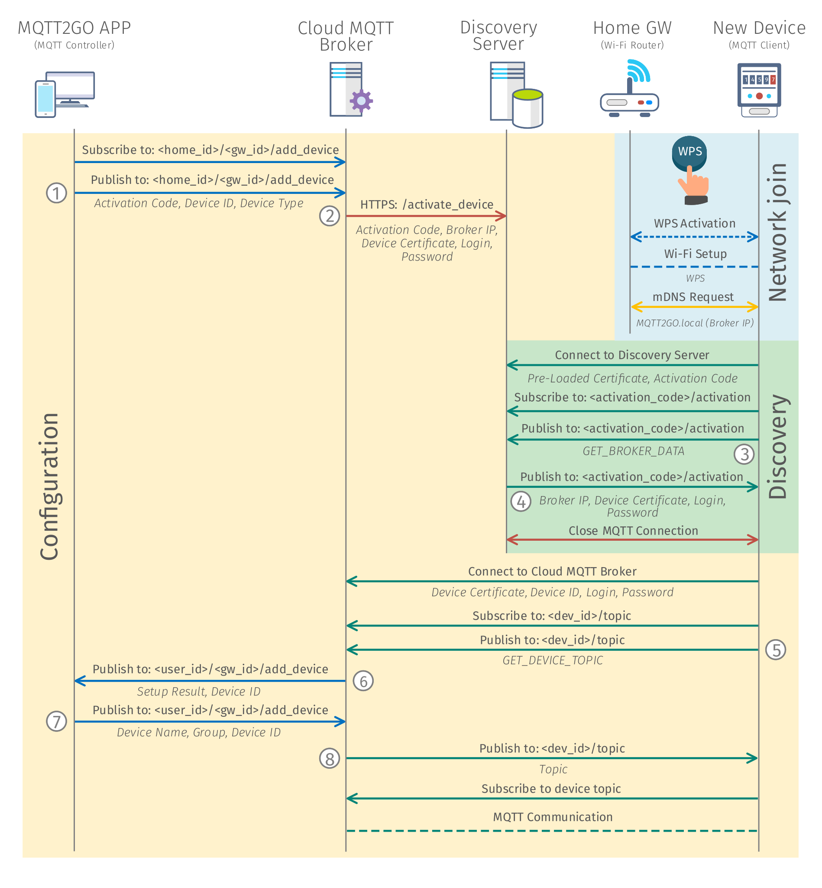

[Back](./index.md#add-devices)
# Setup via WPS with Remote Broker

On top of the typical Smart-Home paradigm with a centerpiece of all communication in the form of SH-GW, MQTT2GO also offers to offload this functionality to the cloud. The local network then does not contains any local MQTT broker, but the whole communication is handled in the cloud. Nevertheless, none of the features of the local broker is missing, and the transition is seamless from the perspective of the end-user.	

From the perspective of the whole communication infrastructure, one new element is required to be presented. This element is called the Discovery server and allows end devices to discover the address of the cloud MQTT broker. Further, an additional communication channel between the cloud broker and the Discovery server is needed, as it will be described in the following text.

The following steps cover the optimal case with WPS functionality. When the WPS is not present, the process is more complicated and requires additional user interaction. These steps mainly consist of delivering the SSID and password of home Wi-Fi.

## Setup Steps
1.	MQTT Controller (Mobile/Web App) initiates the process of adding a new device by subscribing to __/\<home_id\>/\<gw_id\>/add_device__. Then it publishes an activation request containing __activation code__ and __device id__. These codes can be found on the newly installed device in the form number or QR code.
2.	The MQTT broker then contacts the Discovery server and adds the newly installed device into the database of devices waiting for activation. The communication is conducted via __REST API__ over HTTPS protocol. All data including cloud MQTT __broker IP__, __activation code__ and newly generated __certificate__, are delivered to the __/activate_device__ endpoint. The device is not stored in the database permanently, but it is removed after 15 minutes. This approach limits the time window during which the device can be activated, but also adds an additional level of security.
3.	In the meantime, the MQTT end device connects to the home Wi-Fi via WPS and looks for the network for the MQTT2GO.local address.
4.	When the MQTT broker is not founded in the local network, end device contacts the Discovery server. The address of the server is pre-loaded in the device during the manufacturing process.
5.	The end device utilizes the pre-loaded certificate together with the activation code to connect to the MQTT broker on the Discovery server. As in the case of other activation procedures, the certificate of the server must be issued by the same CA (Certification Authority). Otherwise, the TLS (Transport Layer Security) communication cannot be established.
6.	Further, the end device subscribes to the __\<activation_code\>/activation__ topic and publishes the _GET_BROKER_DATA_ request.
7.	As a response MQTT broker on the Discovery server delivers the cloud broker IP address and the new certificate obtained in step 5. The end device further closes the connection to the MQTT broker on the Discovery server.
8.	The end device connects to the remote MQTT broker with the certificate from the previous step and subscribes to __\<device_id\>/topics__.
9.	In the next step, the MQTT end device publishes _GET_DEVICE_TOPICS request_.
10.	As a result, the MQTT broker publishes the message to __\<home_id\>/\<gw_id\>/add_device__ topics with device type and __device id__ information.
11.	MQTT broker then expects a message from MQTT Controller with the end __device name__, __group__, and __id__.
12.	Based on the information from the previous step, the MQTT broker generates a topic structure for the end device and publishes the topics to the __\<dev_id\>/topics__.
13.	In this step, the MQTT end device subscribes to its topics, and all ongoing communication happens according to the MQTT2GO standard.

	

	<em>Process of adding a new MQTT2GO device with remote broker.</em>

[Back](./index.md#add-devices)